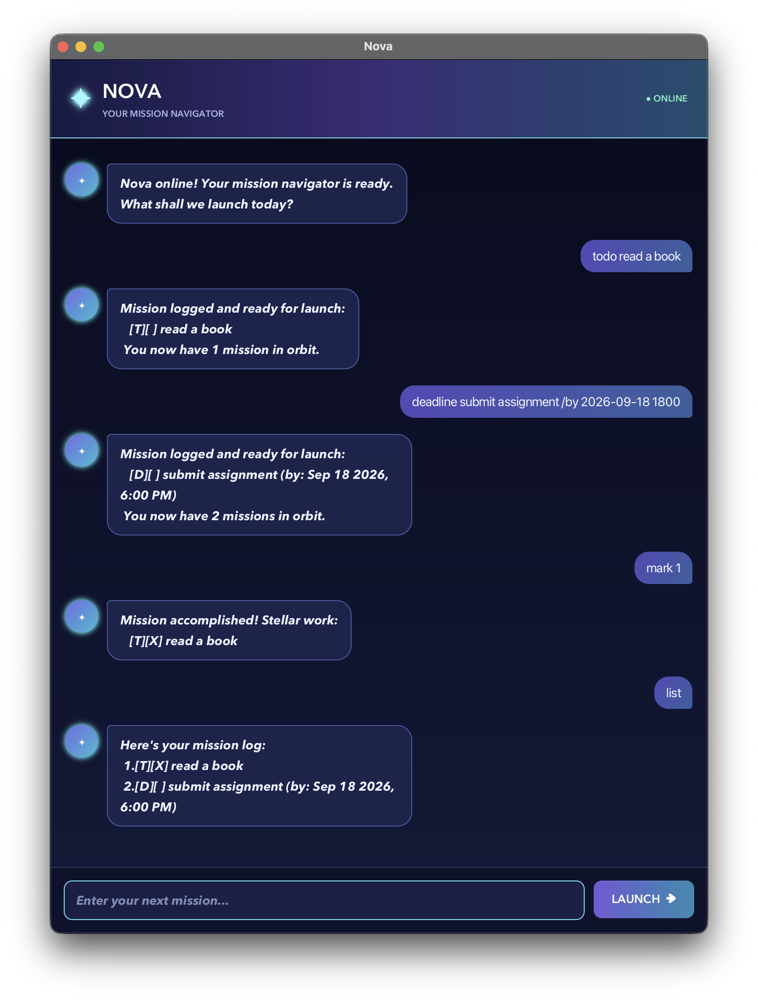

# Nova User Guide

Nova is a cheerful, space-themed task manager that helps you track todos, deadlines, and events
through simple typed commands.



## Quick start

1. Ensure that Java 25 is installed.
2. Place `nova.jar` in the folder where you want Nova to keep its data.
3. Open a terminal in that folder and run:

   ```shell
   java -jar nova.jar
   ```

4. Type a command in the box at the bottom of the window, then press **Enter** or click
   **LAUNCH**.

Try these commands to get started:

```text
todo Read the project requirements
deadline Submit user guide /by 2026-09-18 1800
event Team meeting /from 2026-09-19 1400 /to 2026-09-19 1530
list
```

Nova saves changes automatically, so there is no save command.

## Understanding commands

- Words in `UPPER_CASE` are values you supply. For example, replace `DESCRIPTION` with
  `Read the project requirements`.
- `TASK_NUMBER` is the number shown beside a task by `list`, `find`, or `on`.
- Dates can use `yyyy-MM-dd` or `d/M/yyyy`, such as `2026-09-18` or `18/9/2026`.
- Add an optional four-digit, 24-hour time (`HHmm`) after a date, such as `2026-09-18 1800`.
- Task descriptions may contain spaces.

The symbols in the task list show each task's type and status:

| Symbol | Meaning |
|---|---|
| `[T]` | Todo |
| `[D]` | Deadline |
| `[E]` | Event |
| `[ ]` | Not completed |
| `[X]` | Completed |

## Features

### Adding a todo: `todo`

Adds a task without a date or time.

Format: `todo DESCRIPTION`

Example: `todo Review pull request feedback`

### Adding a deadline: `deadline`

Adds a task that must be completed by a particular date or date-time.

Format: `deadline DESCRIPTION /by DATE_OR_DATETIME`

Examples:

- `deadline Submit user guide /by 2026-09-18`
- `deadline Submit user guide /by 18/9/2026 1800`

### Adding an event: `event`

Adds an activity with a start and end. The end cannot be earlier than the start.

Format: `event DESCRIPTION /from START /to END`

Examples:

- `event Orientation week /from 21/9/2026 /to 25/9/2026`
- `event Project meeting /from 2026-09-19 1400 /to 2026-09-19 1530`

### Viewing all tasks: `list`

Shows every task in its current order. Use the displayed numbers with commands such as `mark`,
`edit`, and `delete`.

Format: `list`

### Finding tasks by description: `find`

Shows tasks whose descriptions contain the given text. Matching is case-insensitive, and results
retain their numbers from the full task list.

Format: `find KEYWORD`

Example: `find project`

### Finding tasks by date: `on`

Shows deadlines due on a date and events occurring on that date. A multi-day event matches every
date from its start through its end. Todos are not included because they have no date.

Format: `on DATE`

Example: `on 2026-09-19`

### Marking a task as completed: `mark`

Changes the selected task's status from `[ ]` to `[X]`.

Format: `mark TASK_NUMBER`

Example: `mark 2`

### Reopening a task: `unmark`

Changes the selected task's status from `[X]` to `[ ]`.

Format: `unmark TASK_NUMBER`

Example: `unmark 2`

### Editing task details: `edit`

Changes one field while preserving the task's type, completion status, list position, and other
details.

Format: `edit TASK_NUMBER FIELD NEW_VALUE`

Supported fields:

| Task type | Fields |
|---|---|
| Todo | `/description` |
| Deadline | `/description`, `/by` |
| Event | `/description`, `/from`, `/to` |

Examples:

- `edit 1 /description Review final pull request`
- `edit 2 /by 2026-09-18 2000`
- `edit 3 /to 1700`

When editing `/by`, `/from`, or `/to`, you may provide a complete date or date-time. You may also
provide only an `HHmm` time, as in the last example, to retain that field's existing date. Edit one
field per command; an edited event must still end at or after its start.

### Deleting a task: `delete`

Permanently removes the selected task. Remaining tasks are renumbered.

Format: `delete TASK_NUMBER`

Example: `delete 3`

### Exiting Nova: `bye`

Displays a farewell message and closes Nova.

Format: `bye`

## Saving data

Nova automatically saves after every command that changes your tasks. Saved tasks are loaded the
next time Nova starts.

Data is stored in `data/nova.txt`, relative to the folder from which Nova is run. Keep this file if
you move Nova to another computer. Avoid editing it manually unless you have made a backup, as
invalid data may prevent Nova from loading the saved tasks.

## Command summary

| Action | Command | Example |
|---|---|---|
| Add a todo | `todo DESCRIPTION` | `todo Review feedback` |
| Add a deadline | `deadline DESCRIPTION /by DATE_OR_DATETIME` | `deadline Submit report /by 2026-09-18 1800` |
| Add an event | `event DESCRIPTION /from START /to END` | `event Team sync /from 2026-09-19 1400 /to 2026-09-19 1530` |
| List tasks | `list` | `list` |
| Find by description | `find KEYWORD` | `find report` |
| Find by date | `on DATE` | `on 2026-09-19` |
| Complete a task | `mark TASK_NUMBER` | `mark 2` |
| Reopen a task | `unmark TASK_NUMBER` | `unmark 2` |
| Edit one field | `edit TASK_NUMBER FIELD NEW_VALUE` | `edit 2 /by 2026-09-20` |
| Delete a task | `delete TASK_NUMBER` | `delete 3` |
| Exit | `bye` | `bye` |
